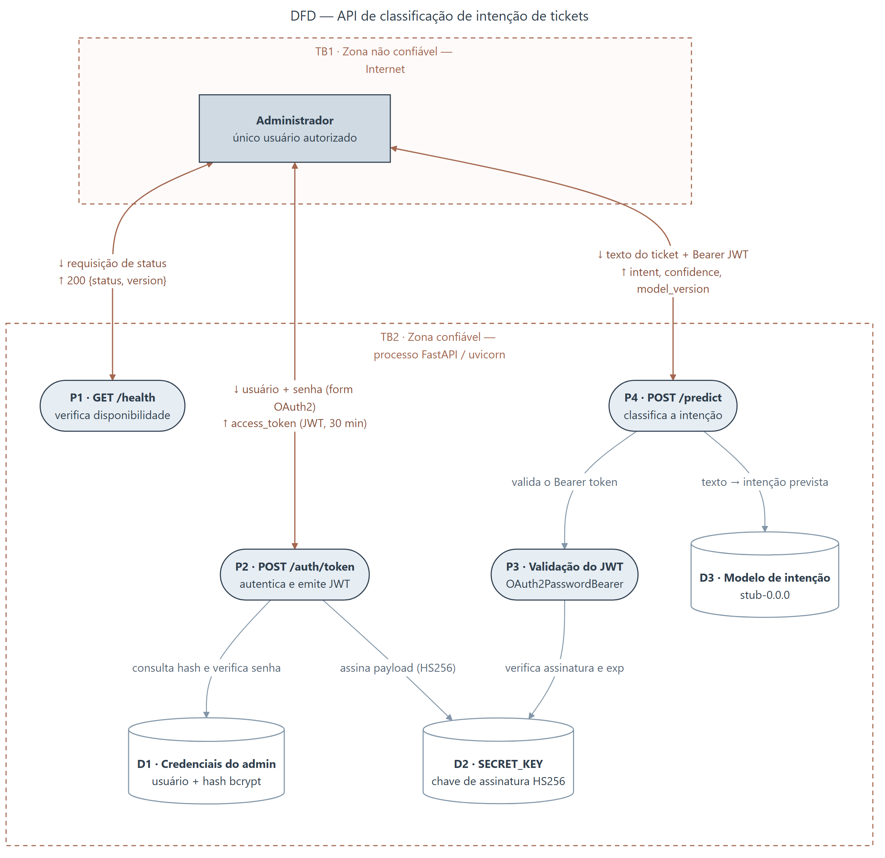

# Modelagem de ameaças

O diagrama de fluxo de dados está em [`others/dfd.png`](../others/dfd.png), gerado a partir do fonte Mermaid [`others/dfd.mmd`](../others/dfd.mmd).

## Elementos

| Id | Tipo | Elemento |
|---|---|---|
| — | Entidade externa | Administrador — único usuário autorizado |
| `P1` | Processo | `GET /health` |
| `P2` | Processo | `POST /auth/token` |
| `P3` | Processo | Validação do JWT (`OAuth2PasswordBearer`) |
| `P4` | Processo | `POST /predict` |
| `D1` | Depósito | Credenciais do admin — usuário e hash bcrypt |
| `D2` | Depósito | `SECRET_KEY` — chave de assinatura HS256 |
| `D3` | Depósito | Modelo de intenção (`stub-0.0.0`) |

## Fronteiras de confiança

- **TB1 — borda de rede.** Separa a Internet do processo da aplicação. Todo tráfego que a atravessa carrega credenciais, token ou dado do cliente, e depende de TLS para manter confidencialidade e integridade em trânsito.
- **TB2 — processo FastAPI/uvicorn.** Delimita a zona confiável onde residem os depósitos de dados. Nenhum segredo (`D1`, `D2`) atravessa TB1 de volta ao cliente: apenas o token assinado e a predição deixam a zona confiável.

## Tríade CIA por componente

| Componente | Confidencialidade | Integridade | Disponibilidade |
|---|---|---|---|
| Credenciais em trânsito (`POST /auth/token`) | Crítica — trafegam apenas sob TLS e nunca são registradas em log | Crítica — adulteração permite login indevido | Média — falha impede a emissão de novas sessões |
| `D1` — hash bcrypt do admin | Crítica — expõe a senha a ataque offline de dicionário | Crítica — substituir o hash concede acesso ao atacante | Alta — sem ele nenhum login é possível |
| `D2` — `SECRET_KEY` | Crítica — permite forjar JWT válido para qualquer usuário | Crítica — troca indevida invalida todos os tokens em uso | Alta — sem ela a API não autentica nem valida tokens |
| Token JWT emitido | Alta — o portador obtém acesso integral a `/predict` | Crítica — a assinatura HS256 impede alteração de `sub` e `exp` | Média — a expiração de 30 min é limite deliberado |
| `P4` — `POST /predict` | Média — a resposta revela o comportamento do modelo | Alta — a intenção retornada orienta o roteamento do chamado | Alta — é a função de negócio da aplicação |
| Texto do ticket (entrada) | Alta — pode conter dados pessoais informados no relato | Alta — texto truncado ou alterado produz classificação errada | Média — a requisição pode ser reenviada pelo cliente |
| `D3` — modelo de intenção | Média — os artefatos do modelo são ativo interno | Crítica — modelo adulterado enviesa todo o atendimento | Alta — indisponibilidade derruba a rota `/predict` |
| `P1` — `GET /health` | Baixa — não expõe dado sensível nem versões de dependências | Média — status falso-positivo mascara um incidente | Alta — é a base do monitoramento externo |

## Limitações conhecidas desta entrega

Registradas de forma deliberada, por serem consequência do escopo definido no enunciado:

- `SECRET_KEY` possui valor de *fallback* no código. É seguro apenas quando a variável de ambiente está definida.
- O token não tem mecanismo de revogação: uma vez emitido, permanece válido pelos 30 minutos de vida útil.
- As credenciais são mantidas no código-fonte, conforme exigido pelo enunciado, em vez de um armazenamento externo.
